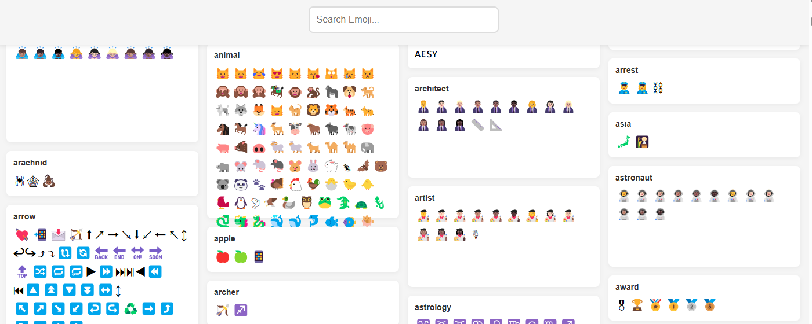

# 🎯 Emoji Free

> A Chrome extension for quickly searching and finding emoji expressions.

<p align="center">
  
</p>

<p align="center">
  
  
  
</p>
<p align="center">
  
</p>

## ✨ Features

- 🚀 Fast emoji search functionality
- 🎨 Clean and intuitive interface
- 📚 Support for all standard emoji categories
- ⚡️ Real-time search results
- 🔄 Multiple emoji display formats


## 📦 Installation

### Manual Installation
1. Download or clone this repository
   ```bash
   git clone https://github.com/shalom-lab/emoji-free.git
   ```
2. Open Chrome and navigate to `chrome://extensions/`
3. Enable "Developer mode" in the top right
4. Click "Load unpacked"
5. Select the extension directory

## 🚀 Usage

1. Click the Emoji Hub icon in your Chrome toolbar
2. Type in the search box to find emojis
3. Browse through categories or search by keywords
4. Copy it to your clipboard

## 🙏 Acknowledgments

This project uses emoji data from:
- [hadley/emo](https://github.com/hadley/emo) - R package for easily inserting emoji
- [muan/emojilib](https://github.com/muan/emojilib/) - Emoji keyword library